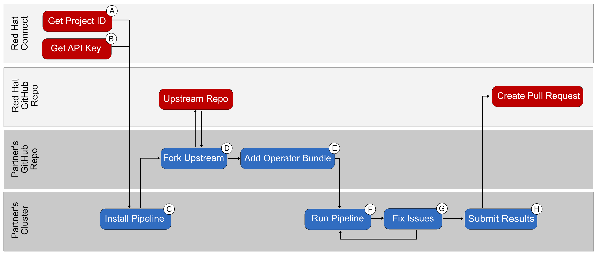

# CI Pipeline Overview




## Step A - Get Project ID
The Project ID can be obtained from connect.redhat.com
1. Navigate to connect.redhat.com
2. Click the login icon
3. Click the Log in for technology partners button
4. Login with your Red Hat Credentials
5. In the top navigation click the Product certification dropdown
6. In the dropdown click the Manage certification projects link
7. Click the project link in the Project Name column for the target project
8. From the project page pull the project ID from the URL or from the PID: displayed on screen
> Note: If using the project ID from the PID, drop the `ospid-` prefix.  The remaining string is the project id. 

## Step B - Get API Key
The container API key can be obtained from connect.redhat.com
1. Navigate to connect.redhat.com
2. Click the login icon
3. Click the Log in for technology partners button
4. Login with your Red Hat Credentials
5. In the top navigation click the Product certification dropdown
6. In the dropdown click the Container API kyes link
7. From the `My API Keys` screen click the `Generate New Key` button
8. In the popup screen enter a descriptive Key Name and click the `save` button
9. Your API Key will be generated and displayed on screen. 
> Important: Copy the API Key from the screen as you won't be able to view it again

## Step C - Install Pipeline
The OpenShift Operator Certification Pipeline is based upon the open source cloud native CI/CD project named [Tekton](https://tekton.dev/)

To install the Pipeline follow the Alpha Instructions. In particular you will need to execute [Step 1](ci-pipeline-beta.md#step1), [Step 2](ci-pipeline-beta.md#step2), [Step 3](ci-pipeline-beta.md#step3), [Step 4](ci-pipeline-beta.md#step4), [Step 5](ci-pipeline-beta.md#step5), [Step 6](ci-pipeline-beta.md#step6) and [Step 7](ci-pipeline-beta.md#step7)

## Step D - Fork Upstream
The OpenShift Operator Certification workflow is based upon Tekton Pipelines and GitHub Pull Requests.  In this step you create a forked copy of the [Red Hat Certified Operators Preprod](https://github.com/redhat-openshift-ecosystem/certified-operators-preprod) repository. 

Instructions for forking a GitHub repo [can be found here](https://docs.github.com/en/get-started/quickstart/fork-a-repo). 

## Step E - Add Operator Bundle
Once you have forked the upstream preprod repo you will need to add your Operator bundle to the forked repo. The forked repo will have a directory structure similar to the structure outlined below. 

```bash
├── config.yaml
├── operators
  └── my-operator
      ├── 1.4.6
      │   ├── manifests
      │   │   ├── cache.example.com_my-operators.yaml
      │   │   ├── my-operator-controller-manager-metrics-service_v1_service.yaml
      │   │   ├── my-operator-manager-config_v1_configmap.yaml
      │   │   ├── my-operator-metrics-reader_rbac.authorization.k8s.io_v1_clusterrole.yaml
      │   │   └── my-operator.clusterserviceversion.yaml
      │   └── metadata
      │       └── annotations.yaml
      └── ci.yaml
```
Take note of the `operators` directory in the forked repo. Add your Operator Bundle under this `operators` directory following the example format. 
1. Under the `operators` directory, create a new directory with the name of your operator.  
1. Inside of this newly created directory add your `ci.yaml`.  
1. Also, under the new directory create a subdirectory for each version of your Operator.  
1. In each version directory there should be a `manifests/` directory containing your OpenShift yaml files and a `metadata/` directory containing your `annotations.yaml` file.

For details on creating an Operator Bundle, see the [instructions here](https://sdk.operatorframework.io/docs/olm-integration/). 

## Step F - Run Pipeline
Once your Operator Bundle has been added to your forked version of the Preprod repo, you are ready to run the pipeline.

#### Minimal Pipeline Run
This is the most basic pipeline run. It does not include digest pinning, which will be required for submission, but the minimal pipeline run is useful for testing and iteration. The minimal pipeline run leverages the internal OpenShift container registry

[Instructions for a minimal pipeline run.](ci-pipeline-beta.md#minimal-pipeline-run)

#### Pipeline Run with Image Digest Pinning
Digest Pinning is required when submitting the results to Red Hat. Container images can be referenced by tags or by SHA digest.  For Red Hat Certification we require the SHA digest for all containers. This requirement is due to the fact that tags are mutable and can be changed underneath us whereas SHA digest are immutable.  The Digest Pinning function in the pipeline will scan through all the manifest files looking for tags and if found, the tool will replace the tags with SHA digest.

[Instructions for a pipeline run with image digest pinning.](ci-pipeline-beta.md#img-digest-pipeline-run)

#### Pipeline Run with a Private Container Registry
By default the Certification Pipeline will run with the OpenShift internal registry. If you want to use a different public or private registry, that is supported as well.

[Instructions for running the pipeline with an external public or private registry.](ci-pipeline-beta.md#private-registry-pipeline-run)

## Step G - Fix Issues
With the CI Pipeline you will be able to iterate on our Operator Bundle to ensure it meets all the requirements for Red Hat Certification. When you execute the pipeline you will be able to view logs that contain details about any errors or failures that will need to be addressed before obtaining certification. 

#### Reading logs from the terminal
When executing the pipeline using the `tkn` cli tool logs will be printed in the terminal. 

#### Viewing logs in the console
If you have access to the OpenShift Console you can review the results of the pipeline and the logs in the Console as well. 

## Step H - Submit Results
Once you have successful results for all the certification checks you can then submit the results to Red Hat for verification and publication in the Operator catalog. 
